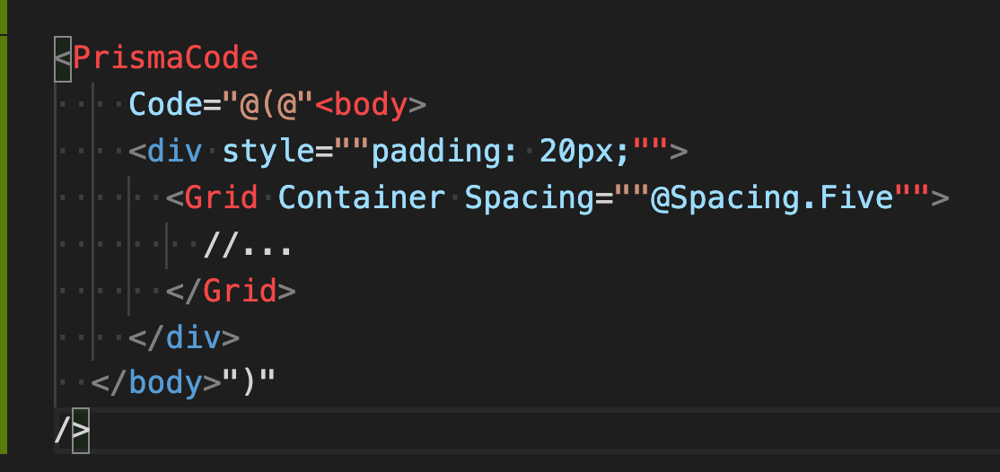
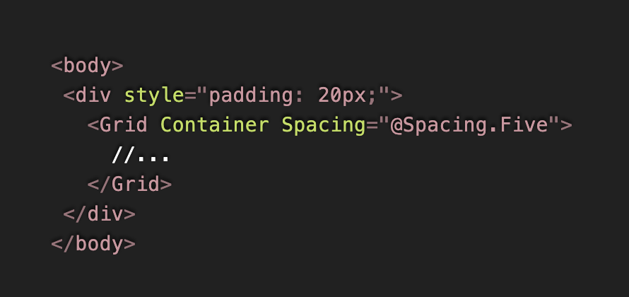

Skclusive.Script.Prisma
=============================

Code Highliter component library for Blazor. Integrating PrismaJs.

## Installation

Add a reference to the library from [](https://www.nuget.org/packages/Skclusive.Script.Prisma/)

## Usage

Add the following in `_Imports.razor`:

```cs
@using Skclusive.Script.Prisma
```

Make the registration in **Startup.cs**

```cs
public class Startup
{
    public void ConfigureServices(IServiceCollection services)
    {
        services.AddPrisma();
    }

    public void Configure(IComponentsApplicationBuilder app)
    {
        app.AddComponent<App>("app");
    }
}
```

Add the resources in **App.razor**

```html
<PrismaStyles />
<PrismaScript />

<Router AppAssembly="@typeof(Program).Assembly">
    ....
</Router>
```

you can use the **PrismaCode** component to render code block as blow



Following is the rendered output in dark theme.



## License

Skclusive.Script.Prisma is licensed under [MIT license](http://www.opensource.org/licenses/mit-license.php)
